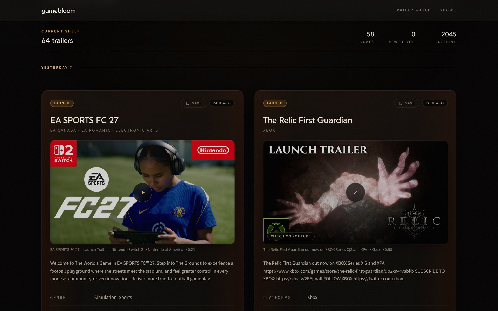
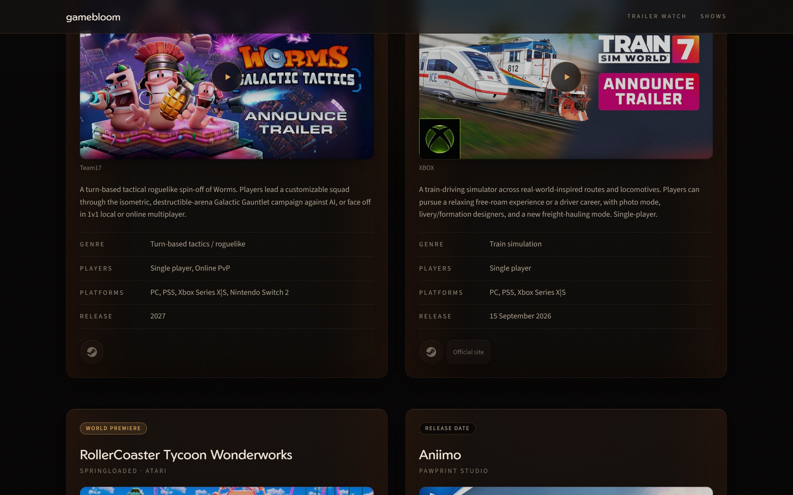
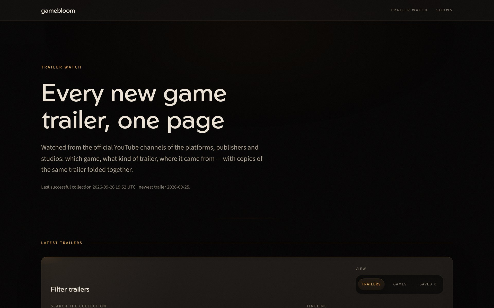
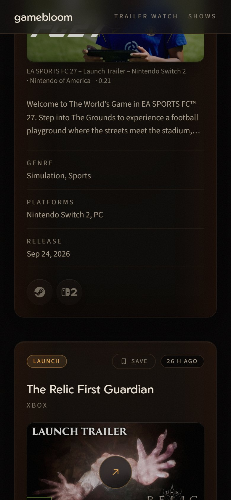

# gamebloom

**Every new game trailer on one page, and every game from the big showcases, indexed one by one.**

**[gamebloom.vercel.app](https://gamebloom.vercel.app)**

  

> This repository is a showcase. The source code is private; the site itself is public and free to use.

## Why it exists

Showcases are made for watching, not for remembering. Two hours later you know you liked something with
a hook and a bleak tunnel in it, and you have no idea who made it, what it runs on or when it is out. The
official recap is a three-hour video without chapters, and no single press roundup is complete.

And between the shows, trailers land every day on dozens of YouTube channels - platforms, publishers,
studios - often the same cut uploaded three times by three different accounts.

## What it does

**Trailer Watch** (the home page) follows the official YouTube channels of platforms, publishers and
studios. Every new trailer shows up with the game, the kind of trailer (announce, launch, gameplay,
release date), Steam data, genre and platforms. Copies of the same trailer are folded into one card, so the
feed shows each trailer once.

**Shows** index a showcase game by game. Each card carries the developer, publisher, genre, platforms,
player modes, release date, store links and the trailer, and every field traces back to a source. Two
orders: **show order** for catching up on what you missed, and **soonest release** - the order the
broadcast hides.

- [gamescom Opening Night Live 2026](https://gamebloom.vercel.app/shows/gamescom-onl-2026) - 72 games
- [Nintendo Direct, 9 September 2026](https://gamebloom.vercel.app/shows/nintendo-direct-2026-09-09) - 61 games

  

## How the data is built

- **Nothing is guessed.** The Opening Night Live list came from the consensus of thirteen independent
  roundups, because the official video has no chapter markers. Every disagreement was recorded and resolved.
- **Every fact is derived twice.** A second pass re-derived each record without seeing the first one. The
  two disagreed on 61 of 72 records; 39 fields were genuinely wrong and were fixed against a primary source.
  One game listed as "no date announced" had been out for four months.
- **Duplicates are folded, carefully.** Obvious re-uploads are merged by rules in code. The grey zone goes to
  a small classification model; only confident matches are merged automatically, the uncertain ones wait in a
  review queue for a human decision.
- **Empty is better than invented.** Where a fact does not exist yet - no publisher, no platforms, no
  timestamp - the field stays empty and the record says why.

  
  &nbsp;
  

## Stack

Next.js (App Router), React, TypeScript, Tailwind, deployed on Vercel. Pages are static; a scheduled
collector refreshes the trailer data, and no video player loads until you click a trailer.

---

Made by [Chronosaur](https://github.com/Chronosauros). Game names, artwork and trailers belong to their
respective owners; gamebloom links to the official sources.
